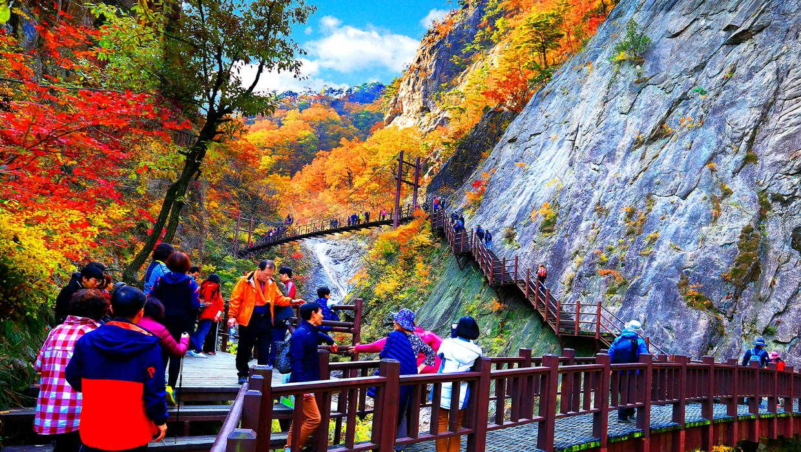

# 강원지역 명소
1. 설악산

세계적으로 희귀한 자연자원의 분포 서식지로 1982년 유네스코(UNESCO)에 의해 우리나라 최초로 생물권보전지역으로 설정되었으며 설악산 인근 마을에서 생산되는 청정 농수산물을 판매해 지역주민들에게 경제적 이익을 주고, 보전을 위한 다양한 프로그램을 운영하고 있다.
설악산은 천연보호구역, 국립공원, 생물권보전지역으로 지정된 우리나라 식물자원의 보고이다. 낙엽활엽수와 상록침엽수의 혼효림으로 이루어져있고, 부분적으로는 단순림을 형성한 곳도 있다.

 식물분포로는 북방계식물의 남한지대인 동시에 남방계식물의 북한지대로서 중요한 곳이다. 설악산의 주요 경관으로는 호박바위, 기둥바위, 넓적바위 등이 공룡능선, 용아장성, 울산바위를 중심으로 발달해 있어 우리나라 제일의 암석지형의 경관미를 갖춘 국립공원이다. 설악산의 아름다운 경관과 다양한 동식물의 터전인 점을 유네스코와 IUCN 등 세계기구에 인증 받아 그 가치를 더욱 빛내고 있다.

